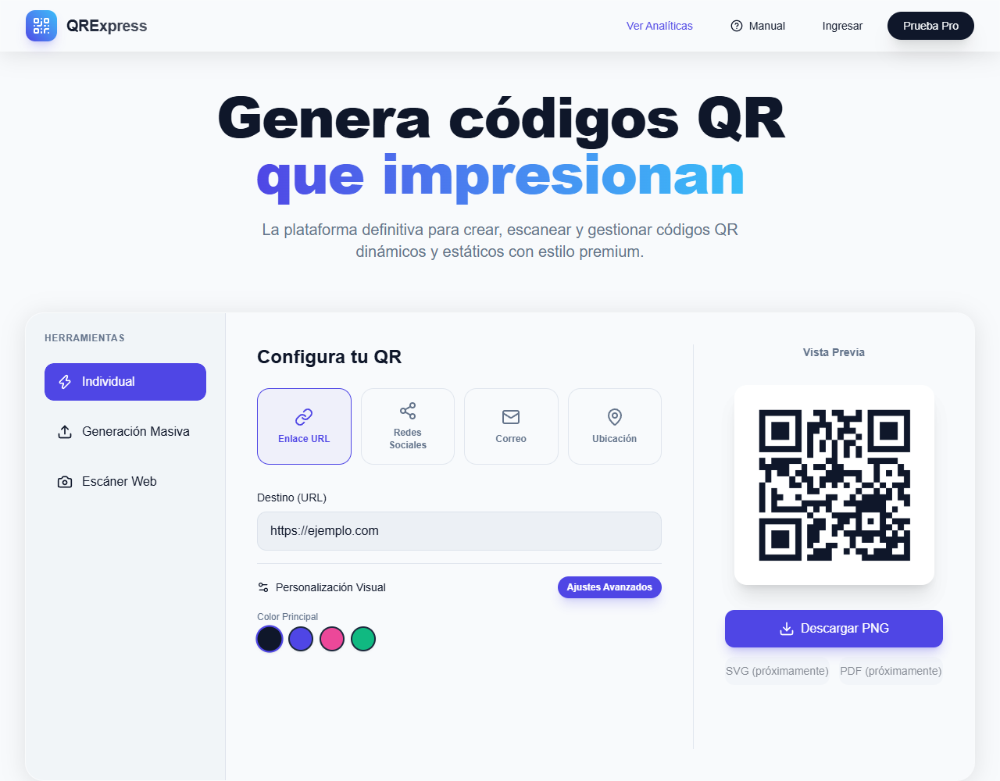
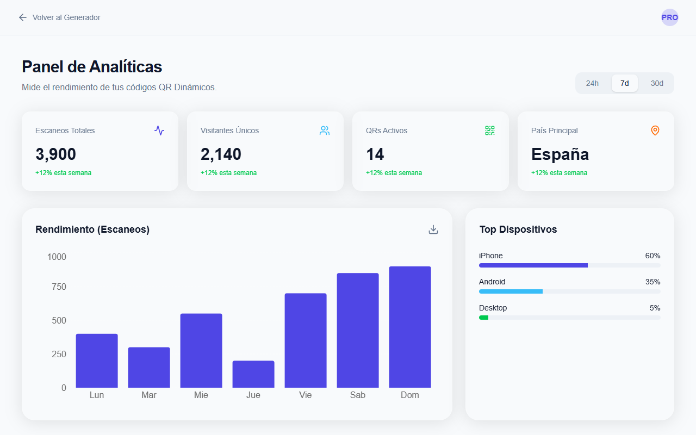
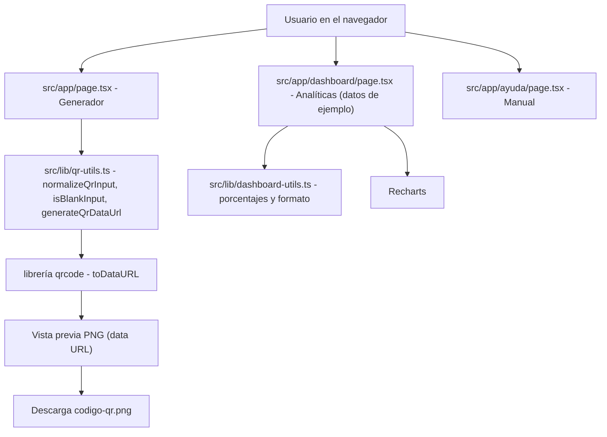

<div align="center">
  
  <h1>QRExpress</h1>
  <p><b>Generador de códigos QR en el navegador: escribes un texto o enlace, ves el QR al instante y lo descargas en PNG.</b></p>

  
  
  
  
  
  <a href="https://github.com/Luiss2080/QRExpress/actions/workflows/ci.yml"></a>
  

  <p>
    <a href="#-inicio-rápido">Inicio rápido</a> ·
    <a href="#-características">Características</a> ·
    <a href="#-arquitectura">Arquitectura</a> ·
    <a href="#-pruebas">Pruebas</a> ·
    <a href="#-lo-que-todavía-no-existe">Limitaciones</a>
  </p>
</div>

QRExpress genera códigos QR a partir de texto o URLs **100 % en el navegador** (sin backend, sin
cuentas, sin base de datos), con vista previa en vivo, cuatro colores y descarga en PNG. **No** es
todavía la plataforma SaaS que describía su README anterior ni la que insinúa parte de la propia
interfaz ("plataforma definitiva…", "Prueba Pro"): escáner, generación masiva, SVG/PDF, QR
dinámicos e historial **no existen aún** (ver [limitaciones](#-lo-que-todavía-no-existe)).

Se desarrolla con [SDD (Spec-Driven Development)](docs/sdd/spec.md): `docs/sdd/spec.md` describe el
alcance **planeado**; este README solo afirma lo que el código de `src/` hace hoy.

## 🎬 Vista rápida

| Generador | Panel de analíticas (datos de ejemplo) |
|---|---|
|  |  |

Capturas reales de `npm run build` + `npm run start`. El panel muestra cifras **hardcodeadas**.

## ✨ Características

| Característica | Detalle (verificado en código) |
|---|---|
| QR en tiempo real | Se regenera al escribir en "Destino" con la librería `qrcode` (400 px, margen 2) |
| Normalización de URL | En el tipo "Enlace URL", un dominio sin protocolo (`ejemplo.com`) recibe `https://` (`normalizeQrInput`) |
| Errores visibles | Campo vacío o texto que excede la capacidad del QR muestran un mensaje con `role="alert"` y un toast (`sonner`) |
| Selector de tipo | Enlace URL, Redes Sociales, Correo y Ubicación: **solo cambia la etiqueta y la normalización de URL**; los cuatro usan el mismo texto libre |
| Color | 4 colores predefinidos (negro azulado, índigo, rosa, verde esmeralda) aplicados a la vista previa y al PNG |
| Logo | Se sube una imagen que se superpone en la **vista previa**; no se incrusta en el PNG (la interfaz lo avisa) |
| Descarga | PNG (`codigo-qr.png`) |
| Panel `/dashboard` | Gráficos con Recharts sobre datos de ejemplo; selector 24h/7d/30d solo cambia el botón activo |
| Manual `/ayuda` | Página estática de guía de uso |
| Accesibilidad | Pestañas con roles ARIA, `<label>` asociados, swatches con nombre accesible, modal de ajustes con foco y cierre con Escape |

## 🏗️ Arquitectura



Todo se ejecuta en el cliente; `next build` genera páginas estáticas (`/`, `/ayuda`, `/dashboard`) y
un icono dinámico (`/icon`).

## 🚀 Inicio rápido

| Requisito | Versión |
|---|---|
| Node.js | 24.x (el que usa el CI y `@types/node` ^24) |
| npm | el que trae Node |

```bash
git clone https://github.com/Luiss2080/QRExpress.git
cd QRExpress
npm ci
npm run dev          # http://localhost:3000
```

Otros comandos (verificados): `npm run build`, `npm run start`, `npm run lint` (0 errores, 11
advertencias), `npm test`.

<details>
<summary>Estructura de carpetas</summary>

```text
src/app/            page.tsx (generador), dashboard/, ayuda/, layout.tsx, icon.tsx, globals.css
src/lib/            qr-utils.ts, dashboard-utils.ts y sus tests (.test.ts)
docs/sdd/spec.md    Especificación SDD (alcance planeado)
docs/MANUAL_DE_USO.md  Manual (ver nota en limitaciones)
legacy_vanilla_js/  Versión histórica en JS puro; no se compila ni se despliega
.github/workflows/ci.yml  Lint + tests + build en push/PR a main
```

</details>

<details>
<summary>Tecnologías</summary>

Next.js 16.3.5 (App Router), React 19.2.8, TypeScript, Tailwind CSS 4, Framer Motion, `qrcode`,
Recharts, sonner, lucide-react. Pruebas: Vitest 5 + Testing Library + jsdom. `jszip` está declarado
pero **no se usa** en `src/`.

</details>

## 🧪 Pruebas

```bash
npm test    # vitest run
```

**18 tests** en 2 archivos, todos pasan. Cubren la lógica pura de `src/lib/`: normalización de URL,
detección de entrada vacía, generación de QR con manejo de errores de capacidad (contra la librería
real) y cálculo de porcentajes del dashboard. Las páginas de React no tienen tests. El CI
(`.github/workflows/ci.yml`) corre `npm run lint`, `npm test` y `npm run build` en cada push y PR a `main`.

## 🔒 Seguridad

No hay backend, autenticación ni almacenamiento: lo que escribes no sale del navegador. El logo
subido se lee como data URL local y no se envía a ningún servidor.

## 🚧 Lo que todavía no existe

- **Escáner por webcam:** la pestaña es un marcador ("Permitir Cámara (próximamente)", botón deshabilitado).
- **Generación masiva CSV:** también un marcador deshabilitado.
- **Exportar SVG / PDF:** botones deshabilitados "próximamente"; solo hay PNG.
- **Logo en el PNG descargado:** solo aparece en la vista previa.
- **Tipos de contenido reales** (`mailto:`, `geo:`, vCard, plantillas de redes): hoy es texto libre.
- **Nivel de corrección de errores:** el desplegable de "Ajustes avanzados" no está conectado a la generación.
- **Modo oscuro:** `globals.css` define estilos `.dark`, pero no hay interruptor ni `next-themes`.
- **Analíticas reales, QR dinámicos, historial, cuentas:** el panel usa datos fijos; los botones "Ingresar" y "Prueba Pro" no hacen nada.
- **Textos que exageran:** el subtítulo de la portada y `docs/MANUAL_DE_USO.md` (aún titulado "QR Pro Ultimate") describen funciones que no están implementadas; `docs/sdd/spec.md` es el plan, no el estado.
- `legacy_vanilla_js/` es histórico: sus afirmaciones no están re-verificadas.

## 📄 Licencia

No hay archivo `LICENSE` en la raíz: sin licencia definida, todos los derechos reservados por
defecto. Solo `legacy_vanilla_js/` incluye su propia licencia MIT, que cubre únicamente ese directorio.

<div align="center">
  <sub>Hecho por Luiss2080 · Santa Cruz de la Sierra, Bolivia</sub>
</div>
